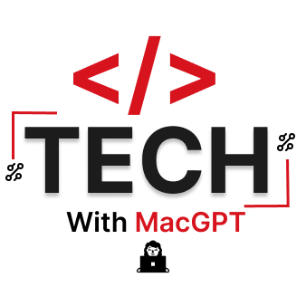

# Hi, I'm Enow Brenda👋

### Software Engineer · Data Science Master's Student · Growing into AI & Robotics

  
  
  
  

 

## 👋 A Little About Me

I'm **Enow Eweh Mac Brenda**, a software engineer by training and a Data Science master's student by choice. I got my start building real, production backend systems, and I'm now deliberately expanding into **AI, machine learning, and — eventually — robotics**.

I'm still early in my AI journey learning it deliberately, project by project, and building on the software engineering foundation I already have. That background means I'm not starting from zero: I know how to build things that hold up with real users and real data, and I'm applying that same rigor as I move into AI.

**My path:** `Software Engineering` → `Data Science` → `AI Engineering` → `Robotics` *(currently here 📍 between Data Science and AI Engineering)*

I'm actively looking for opportunities not only in AI. Software engineering, backend, and full-stack roles are where my experience is strongest today, and I'm just as interested in those. I'm also open to any project that helps me grow a new skill, whether that's paid work, open source, or a collaboration, and I keep a few personal AI side projects going for the same reason.

 

## 💼 Where I've Worked

<table border="0" cellspacing="0" cellpadding="14">
<tr>
<td width="50%" valign="top">

### 🏢 [CREDIXCAM](https://www.credixcm.com/)

Contributed to CREDIXCAM, a fintech rapidly growing in the financial market building backend systems and WhatsApp-integrated applications, and delivering APIs and third-party integrations powering real financial workflows.

</td>
<td width="50%" valign="top">

### 🧩 [Digimark Consulting](https://www.digimarkconsulting.cm/)

Contributed to Digimark Consulting, an IT training and consultancy center working on enterprise-level software: backend services, APIs, and system integrations for business applications.

</td>
</tr>
</table>

 

## 🧠 AI & Machine Learning Projects

*My learning-by-building projects each one pushed me a step further into AI, one concept at a time.*

<table border="0" cellspacing="0" cellpadding="14">

<tr>
<td width="50%" valign="top" align="center">

**🤰 Family Planning Autonomy Predictor**

ML classifier predicting a woman's level of autonomy in family planning decisions turning survey data into public-health insight.

</td>
<td width="50%" valign="top" align="center">

**⏳ Survival Analysis — Age at Circumcision & Risk Factors**

Kaplan-Meier estimation and Cox proportional hazards modeling to identify demographic and socioeconomic factors linked to earlier vs. later timing.

</td>
</tr>

<tr>
<td width="50%" valign="top" align="center">

**🩺 Santé Cameroon — Health Data Insights**

Streamlit dashboard exploring Cameroonian health metrics, with a focus on infant mortality.

</td>
<td width="50%" valign="top" align="center">

**📉 Customer Churn Prediction**

End-to-end pipeline that explicitly handles concept drift and data drift a real production concern most tutorials skip.

</td>
</tr>

<tr>
<td width="50%" valign="top" align="center">

**🧭 Intelligent Agent — Maze Solver**

Search-based AI agent navigating a maze using Depth-First Search foundational planning logic for autonomous systems.

</td>
<td width="50%" valign="top" align="center">

**🃏 Local Card Game with a Minimal AI Opponent**

Playable card game with a lightweight rule-based/minimax opponent practicing game-state representation and simple decision-making.

</td>
</tr>

<tr>
<td width="50%" valign="top" align="center">

**🧪 Introduction to AI — Labs**

Structured labs covering core AI foundations: search, agents, and problem-solving techniques.

</td>
</tr>

</table>

> These range from solid to early-stage  I'm sharing the full journey, not just the polished parts.

 

## 🛠️ Software Engineering Projects

*This is where my strongest, most production-tested work lives.*

<table border="0" cellspacing="0" cellpadding="14">

<tr>
<td width="50%" valign="top" align="center">

**🧹 Sales Data Cleaning & Insights Platform**

React app that lets users upload CSV sales data, auto-clean it (missing values, negative sales, outliers), preview, and download.

</td>
<td width="50%" valign="top" align="center">

**🏢 Company IMS — Internship Management System**

Full-stack platform for managing internships end-to-end, mirroring enterprise systems I've built professionally.

</td>
</tr>

<tr>
<td width="50%" valign="top" align="center">

**🧰 SPOT — Local Service Providers Network**

Laravel web platform connecting local service providers with clients.

</td>
<td width="50%" valign="top" align="center">

**💸 XpenseLog — Personal Finance Desktop App**

Cross-platform desktop app for tracking expenses, income and savings, with separate admin/user dashboards done using Flet (Flutter for python).

</td>
</tr>

<tr>
<td width="50%" valign="top" align="center">

**⏱️ ChronoForge — Android Task Manager**

Native Android task management app with inbuilt chats and basic project management built with Java and XML.

</td>
<td width="50%" valign="top" align="center">

**🧬 X-Anatomy — Interactive Anatomy Explorer**

Open-source tool for interactive visualization of human anatomy, aimed at students and medical professionals.

</td>
</tr>

<tr>
<td width="50%" valign="top" align="center">

**🛋️ ARtistic — AR Ecommerce for Furniture**

AR ecommerce platform where users preview furniture in their own space before buying.

</td>

</tr>

</table>

 

## 🧰 Tools I Work With

**Languages**

**AI / ML / Data**

**Backend & Frameworks**

**Databases & Tools**

 

## 🔭 Currently Focused On

<table border="0" cellspacing="0" cellpadding="12">
<tr>
<td width="50%" valign="top">

**📚 Generative AI & LLM Apps**
: Deepening my skills in machine learninggenerative models, LLM applications, and AI agents.

</td>
</tr>
<tr>
  <td width="50%" valign="top">

**👁️ Computer Vision**
: Exploring perception techniques for autonomous systems.

</td>

</tr>
<tr>
<td width="50%" valign="top">

**🤖 Robotics Foundations**
: Building foundations in robotics and control for intelligent hardware.

</td>
</tr>
<tr>
  <td width="50%" valign="top">

**🏗️ Production-Ready Engineering**
: Applying solid software engineering practices to every AI project, so things ship, not just run once.

</td>
</tr>
</table>

I'm building this skillset step by step, and I'd rather show honest progress than a polished front. If you're hiring for **software engineering, backend, or full-stack roles**, or if you have opportunities in **AI/ML where I can keep growing**, I'd love to talk.

 

## 📊 A Snapshot of My Activity

These are auto-generated and update on their own: the first shows overall activity (commits, PRs, stars), the second shows your most-used languages, and the third shows your daily contribution streak.

 

## 🤝 Reach Out

I'm open to **collaborations, junior/mid-level roles, and any project that will grow my skills** across **software engineering, machine learning, and (eventually) robotics**. Paid work, open source, mentorship-driven builds I'm genuinely up for all of it.

  
  

  
⚡ Building intelligent systems, one commit and one lesson at a time.

